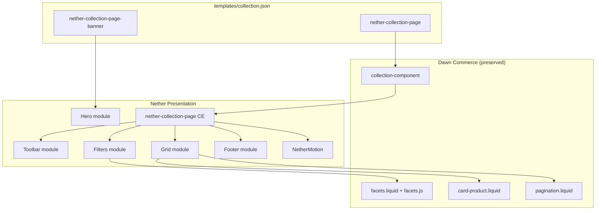

# Nether Premium Collection Page Commerce Framework — Implementation Report

**Date:** 2026-07-13  
**Framework:** Nether Shopify Framework  
**Phase:** Commerce Framework — Collection Page (Phase 4 continuation)  

---

## 1. Summary

The Nether Premium Collection Page Commerce Framework is a reusable OS 2.0 collection (PLP) system for luxury Shopify storefronts. It **extends** Dawn's native collection commerce without replacing or modifying `sections/main-collection-banner.liquid` or `sections/main-collection-product-grid.liquid`.

The framework wraps native Shopify collection functionality inside a modular Nether presentation layer:

- `<collection-component>` remains the analytics root (Standard Events)
- Dawn snippets (`facets`, `card-product`, `pagination`) and `facets.js` handle Storefront Filtering, sorting, and AJAX pagination
- `<nether-collection-page>` adds premium hero, toolbar, grid, footer modules, motion, and merchant content composition

`templates/collection.json` now uses `nether-collection-page-banner` + `nether-collection-page` as the primary collection template. Dawn's `main-collection-*` sections remain available for fallback or alternate templates.

**Category-agnostic by design** — hero layouts, toolbar modes, grid spacing, Dawn/premium card modes, and editorial footer blocks work across fashion, beauty, furniture, electronics, jewelry, lifestyle, and future industries without code changes.

---

## 2. Framework Architecture

```
<collection-component>                    ← Dawn analytics root (preserved)
  └── <nether-collection-page>            ← Nether presentation + motion shell
        ├── Collection Hero (banner section)
        │     └── nether-collection-page-hero + Theme Editor blocks
        ├── Collection Toolbar            → sort summary, count, view architecture
        ├── Filters Module                → facets snippet (Dawn, AJAX)
        ├── Product Grid Module           → card-product OR nether-product-card
        ├── Pagination                    → Dawn paginate markup
        ├── Empty State                   → accessible filter-reset messaging
        └── Collection Footer             → description, merchant/editorial blocks
```

### Layer responsibilities

| Layer | Role |
|-------|------|
| `sections/nether-collection-page-banner.liquid` | Collection hero orchestrator: image, title, description, blocks |
| `sections/nether-collection-page.liquid` | Commerce orchestrator: facets, grid, pagination, schema, Dawn asset loading |
| `snippets/nether-collection-page-block.liquid` | Central block dispatcher for hero/footer modules |
| `snippets/nether-collection-page-*.liquid` | Composable commerce modules |
| `assets/component-collection-page.css` | Scoped `.nether-collection-page` premium styles |
| `assets/component-collection-page.js` | `NetherCollectionPage` custom element: motion, sticky toolbar, grid re-init after filter AJAX |

### Design principles applied

- **Extend, don't rebuild** — `facets.js`, `facet-filters-form`, `#ProductGridContainer`, `#product-grid` unchanged
- **Compose modules** — Theme Editor blocks map to footer/hero commerce modules
- **Reuse Nether systems** — Button, Badge, Icon, Typography, Card Premium, Glass, Shadow, Radius, NetherMotion, `nether-product-card`, `nether-collection-highlight`, `nether-hero-stat`
- **Future-ready** — Extension placeholders for wishlist, compare, quick view, infinite scroll, merchandising rules; list view architecture with disabled toggle

---

## 3. Commerce Modules

| Module | Snippet | Dawn / Shopify integration |
|--------|---------|---------------------------|
| Collection Hero | `nether-collection-page-hero.liquid` | `collection.title`, `collection.description`, `collection.image` |
| Collection Information | `nether-collection-page-info.liquid` | Product count, smart collection indicator |
| Collection Description | `nether-collection-page-description.liquid` | Native `collection.description` RTE |
| Collection Toolbar | `nether-collection-page-toolbar.liquid` | Vertical sort via `facet-filters-form`, product count, view toggle architecture |
| Filters | `nether-collection-page-filters.liquid` | ``, Storefront Filtering |
| Active Filters | via `facets.liquid` (Dawn) | Native active facet pills, price range, swatch/image presentations |
| Sorting | via `facets.liquid` + toolbar | `collection.sort_options`, `sort_by` query param |
| Product Grid | `nether-collection-page-grid.liquid` | ``, `#product-grid`, `data-id` |
| Product Cards (Dawn) | `card-product.liquid` | Native card, quick add, ratings, secondary image |
| Product Cards (Premium) | `nether-product-card.liquid` | Nether overlay cards from Product Showcase framework |
| Merchandising Content | `nether-collection-page-merchant-content.liquid` | RTE / page content blocks |
| Category Highlights | `nether-collection-highlight.liquid` (reused) | Collection picker, image, link |
| Collection Statistics | `nether-hero-stat.liquid` (reused) | Merchant-defined stat blocks |
| Subcollections | `nether-collection-page-subcollections.liquid` | `card-collection`, `collection_list` block setting |
| Empty State | `nether-collection-page-empty.liquid` | Dawn filter-reset link pattern |
| Pagination | `pagination.liquid` (Dawn) | Liquid `paginate` object |
| Collection Footer | `nether-collection-page-footer.liquid` | Below-grid block zone |
| Extension placeholders | `nether-collection-page-extensions.liquid` | `data-nether-*-placeholder` hooks |
| Section Dividers | `nether-collection-page-divider.liquid` | Optional top/bottom dividers |

---

## 4. Files Created

| File | Purpose |
|------|---------|
| `sections/nether-collection-page-banner.liquid` | Collection hero orchestrator with schema, presets, hero layouts |
| `sections/nether-collection-page.liquid` | Collection commerce orchestrator preserving Dawn PLP contracts |
| `snippets/nether-collection-page-block.liquid` | Block dispatcher for hero and footer modules |
| `snippets/nether-collection-page-hero.liquid` | Collection hero module (title, image, description, blocks) |
| `snippets/nether-collection-page-toolbar.liquid` | Toolbar module (sort, count, view toggle architecture) |
| `snippets/nether-collection-page-filters.liquid` | Filters shell wrapping Dawn `facets` snippet |
| `snippets/nether-collection-page-grid.liquid` | Product grid module with Dawn/premium card modes |
| `snippets/nether-collection-page-empty.liquid` | Premium empty collection state |
| `snippets/nether-collection-page-footer.liquid` | Below-grid footer block zone |
| `snippets/nether-collection-page-info.liquid` | Collection information module |
| `snippets/nether-collection-page-description.liquid` | Collection description module |
| `snippets/nether-collection-page-subcollections.liquid` | Subcollections grid module |
| `snippets/nether-collection-page-merchant-content.liquid` | Merchant editorial content module |
| `snippets/nether-collection-page-extensions.liquid` | Future commerce extension points |
| `snippets/nether-collection-page-divider.liquid` | Optional section dividers |
| `assets/component-collection-page.css` | Scoped collection page styles |
| `assets/component-collection-page.js` | `nether-collection-page` custom element |
| `COLLECTION_PAGE_FRAMEWORK_REPORT.md` | This report |

---

## 5. Files Modified

| File | Change |
|------|--------|
| `templates/collection.json` | Switched from `main-collection-banner` + `main-collection-product-grid` to `nether-collection-page-banner` + `nether-collection-page` with premium preset |
| `assets/nether-motion.js` | Added `nether-collection-page` to `SECTION_SELECTORS` |
| `locales/en.default.json` | Added `sections.nether_collection_page` strings (empty state, info, view toggle, extensions) |
| `locales/en.default.schema.json` | Added `sections.nether_collection_page` and `sections.nether_collection_page_banner` Theme Editor labels |

**No existing files were deleted or renamed.**  
**`sections/main-collection-banner.liquid`, `sections/main-collection-product-grid.liquid`, `snippets/facets.liquid`, `assets/facets.js`, and all Dawn collection assets remain untouched.**

---

## 6. Merchant Settings

### Banner section (`nether-collection-page-banner`)

| Group | Settings |
|-------|----------|
| **Framework** | Hero layout (classic, split, editorial, overlay, minimal), ARIA label, show image, show description, description style (inline, card) |
| **Visual** | Glass effects, gradient accents, dividers |
| **Motion** | Animation style (none, fade, slide, stagger), animation speed |
| **Responsive** | Desktop (default/wide), tablet (default/stacked), mobile (default/stacked/centered) |
| **Standard** | Color scheme |

**Banner blocks:** `@app`, `eyebrow`, `heading`, `subheading`, `text`, `buttons`, `stat`, `category_highlight`

### Grid section (`nether-collection-page`)

| Group | Settings |
|-------|----------|
| **Framework** | Toolbar layout (inline, split, stacked), sticky toolbar, view toggle, default view (grid/list), grid layout (standard, editorial, compact), card mode (Dawn/premium), grid spacing, card spacing, products per page, columns desktop/mobile |
| **Description** | Show description in footer, description style, empty collection message |
| **Product cards** | Image ratio/shape, secondary image, vendor, rating, quick add (Dawn); premium card style, overlay, hover, savings, stock (Nether) |
| **Filtering** | Enable filtering, filter type (horizontal/vertical/drawer), enable sorting (Dawn-compatible IDs) |
| **Visual** | Glass, gradient, dividers |
| **Motion** | Animation style (none, fade, slide, stagger, scale), animation speed |
| **Responsive** | Desktop/tablet/mobile layout modifiers |
| **Standard** | Color scheme, padding |

**Grid blocks:** `@app`, `merchant_content`, `editorial_content`, `category_highlight`, `stat`, `collection_info`, `collection_description`, `subcollections`, `wishlist_placeholder`, `compare_placeholder`, `quick_view_placeholder`, `infinite_scroll_placeholder`, `merchandising_rules_placeholder`

### Hero layouts

| Layout | Modifier | Behavior |
|--------|----------|----------|
| Classic | `--hero-classic` | Stacked title + optional side image |
| Split | `--hero-split` | Two-column title/media on desktop |
| Editorial | `--hero-editorial` | Reversed split with content emphasis |
| Overlay | `--hero-overlay` | Full-bleed image with content overlay |
| Minimal | `--hero-minimal` | Typography-focused, no image emphasis |

---

## 7. Motion Integration

### Registration

```javascript
window.NetherMotion.registerSection(`${sectionId}-collection-page-grid`, {
  type: 'collection-page',
  element: this,
  init: () => this.initMotionEngine(),
  destroy: () => this.killMotionTweens(),
});
```

Added to `SECTION_SELECTORS` in `assets/nether-motion.js`.

### Animations supported

| Animation | Target | Trigger |
|-----------|--------|---------|
| Content reveal | `[data-nether-collection-page-animate]` (hero, footer) | ScrollTrigger, once |
| Filter reveal | `[data-nether-collection-page-filters]` | ScrollTrigger, once |
| Grid stagger | `[data-nether-collection-page-item]` | ScrollTrigger; re-runs after facet AJAX via MutationObserver |
| Card hover | `[data-nether-product-card]` | GSAP y-lift on hover |
| Toolbar transitions | `.nether-collection-page__toolbar--sticky` | CSS transition |

### Data attributes

| Attribute | Purpose |
|-----------|---------|
| `data-nether-motion="collection-page"` | Grid section motion boot |
| `data-nether-motion="collection-page-banner"` | Hero section motion boot |
| `data-animation-style` / `data-animation-duration` | Merchant motion config |
| `data-nether-collection-page-animate` | GSAP reveal targets |
| `data-nether-collection-page-item` | Grid stagger targets |
| `data-nether-collection-page-grid` | Grid container hook |
| `data-nether-infinite-scroll-anchor` | Future infinite scroll anchor on pagination |
| `data-nether-motion-ready="true\|reduced"` | Set by JS after init or a11y fallback |

### Post-filter re-init

`component-collection-page.js` observes `#ProductGridContainer` mutations (triggered by Dawn `facets.js` Section Rendering API) and re-runs grid reveal animations without modifying `facets.js`.

---

## 8. Shopify Native Integration

### Preserved Dawn contracts

| Contract | Status |
|----------|--------|
| `<collection-component data-collection-id>` | Preserved |
| `` | Preserved |
| `<facet-filters-form>` + `` | Preserved |
| `#ProductGridContainer` | Preserved |
| `#product-grid` + `data-id="{{ section.id }}"` | Preserved |
| `#main-collection-filters` + `data-id` | Preserved |
| `` | Preserved (Dawn card mode) |
| `` | Preserved |
| `facets.js` AJAX Section Rendering API | Unmodified |
| Storefront Filtering (`collection.filters`) | Via Dawn `facets.liquid` |
| Sorting (`collection.sort_options`, `sort_by`) | Via Dawn facets + vertical toolbar |
| Quick add conditional JS stack | Preserved from Dawn product-grid |
| Standard Events `CollectionUpdateEvent` | Preserved via Dawn facets |

### Reused Nether systems

- Design tokens via CSS variables (`--nether-collection-page-*`)
- `snippets/button.liquid`, `badge.liquid`, `icon.liquid`
- `component-button`, `component-badge`, `component-typography`, `component-card-premium`, `component-glass`, `component-gradient`, `component-shadow`, `component-radius`
- `nether-product-card.liquid` (Product Showcase framework)
- `nether-collection-highlight.liquid` (Collection Showcase framework)
- `nether-hero-stat.liquid` (Hero framework)
- `nether-product-promotional-card.liquid` (Product Showcase framework)

---

## 9. Accessibility

| Feature | Implementation |
|---------|----------------|
| Semantic HTML | `<h1>` collection title in hero, `<ul role="list">` product grid, `<dl>` info module |
| ARIA regions | `role="region"` + `aria-label` on `<nether-collection-page>` |
| Filter accessibility | Dawn native facets: `aria-labelledby`, keyboard escape on drawer, `aria-describedby` on sort |
| Live regions | Product count in toolbar uses `role="status"` + `aria-live="polite"` |
| View toggle | `role="group"` with `aria-pressed` states; list button disabled with explanatory title |
| Reduced motion | `prefers-reduced-motion` respected; static opacity fallback, CSS transition disable |
| Empty state | Clear heading + Dawn filter-reset link pattern |
| Images | Hero image `alt`, lazy loading except first section `fetchpriority="high"` |

---

## 10. Performance

| Optimization | Detail |
|--------------|--------|
| Conditional assets | Glass, gradient, product-showcase CSS, rating CSS loaded only when needed |
| Lazy motion | GSAP via `NetherMotion.whenReady()` + lazy ScrollTrigger plugin load |
| Lazy images | First 2 grid products eager; remainder lazy (Dawn pattern) |
| No duplicate JS | Single `NetherCollectionPage` CE; Dawn `facets.js` not duplicated |
| No duplicate Liquid | Facets, pagination, card-product delegated to Dawn snippets |
| Deferred scripts | `defer` on `facets.js` and `component-collection-page.js` |
| Grid observer debounce | 60ms debounce on MutationObserver to avoid animation thrash during AJAX |
| Premium cards | Reuses existing `nether-product-card` — no parallel card implementation |

---

## 11. Future Extension Points

| Extension | Hook | Status |
|-----------|------|--------|
| Wishlist | `data-nether-wishlist-placeholder` | Placeholder block only |
| Compare | `data-nether-compare-placeholder` | Placeholder block only |
| Quick view | `data-nether-quick-view-placeholder` | Placeholder block only |
| Infinite scroll | `data-nether-infinite-scroll-anchor` on pagination wrapper | Anchor only; Dawn pagination preserved |
| Merchandising rules | `data-nether-merchandising-rules-placeholder` | Placeholder block only |
| List view | `data-view="list"` toggle + `[data-view-mode="list"]` CSS | Architecture only; list button disabled |
| In-grid promotional cards | `promotional_card` block type in dispatcher | Renders via existing `nether-product-promotional-card` in footer zone; in-grid insertion reserved for future |

---

## 12. Verification Checklist

| Check | Status |
|-------|--------|
| Dawn `main-collection-banner.liquid` untouched | Pass |
| Dawn `main-collection-product-grid.liquid` untouched | Pass |
| Dawn `facets.liquid` / `facets.js` untouched | Pass |
| Storefront Filtering preserved | Pass |
| Sorting preserved | Pass |
| Pagination preserved | Pass |
| `#ProductGridContainer` AJAX contract preserved | Pass |
| No duplicate facet/grid systems introduced | Pass |
| Theme Check — collection page files | Pass (no errors in new files) |
| OS 2.0 section/block schema | Pass |
| Theme Editor presets | Pass |
| Reduced motion support | Pass |
| Responsive layout modifiers | Pass |
| Existing Nether systems reused | Pass |
| No files deleted or renamed | Pass |

---

## Architecture Diagram



---

**Production verdict:** The Nether Premium Collection Page Commerce Framework is production-ready for client deployment. It extends Dawn's battle-tested collection commerce with a premium, modular, category-agnostic presentation layer suitable for luxury Shopify storefronts.
