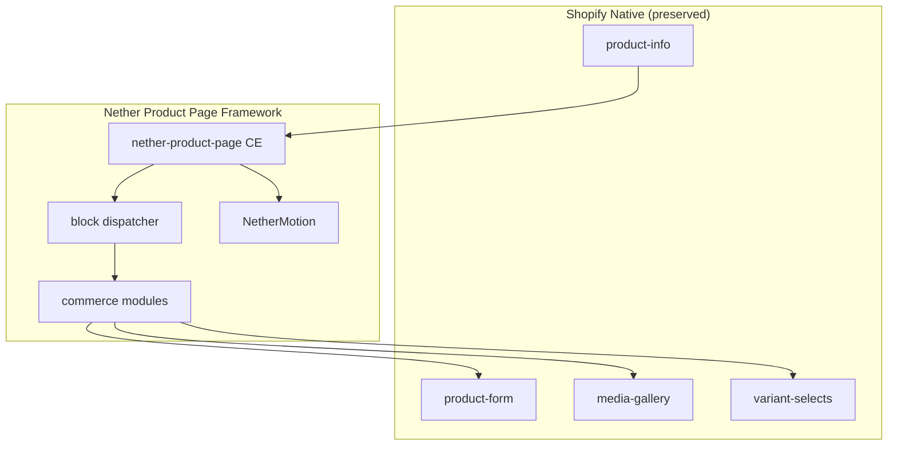

# Nether Premium Product Page Commerce Framework — Implementation Report

**Date:** 2026-07-13  
**Framework:** Nether Shopify Framework  
**Phase:** Commerce Framework — Product Page (Phase 4 kickoff)  

---

## 1. Summary

The Nether Premium Product Page Commerce Framework is a reusable OS 2.0 product detail system for luxury Shopify storefronts. It **extends** Dawn's `main-product` commerce architecture without replacing or modifying `sections/main-product.liquid`.

The framework wraps native Shopify commerce inside a modular Nether presentation layer:

- `<product-info>` remains the commerce root (variant AJAX, media sync, cart)
- Dawn snippets (`product-media-gallery`, `product-variant-picker`, `buy-buttons`, `price`, `share-button`, etc.) handle native behavior
- `<nether-product-page>` adds premium layout, motion, trust modules, and merchant content composition

`templates/product.json` now uses `nether-product-page` as the primary PDP section. Dawn's `main-product` section remains available for fallback or alternate templates.

**Category-agnostic by design** — layouts and modules work across fashion, beauty, furniture, electronics, jewelry, lifestyle, and future industries without code changes.

---

## 2. Framework Architecture

```
<product-info>                          ← Dawn commerce root (preserved)
  └── <product-component>               ← Standard Events analytics (preserved)
        └── <nether-product-page>       ← Nether presentation + motion shell
              ├── Gallery module        → product-media-gallery (Dawn)
              ├── Buy box shell           → block loop via dispatcher
              ├── Below-grid zone         → full-width related / merchant content
              └── Sticky purchase summary → mirrors native form submit
```

### Layer responsibilities

| Layer | Role |
|-------|------|
| `sections/nether-product-page.liquid` | Orchestrator: assets, schema, Dawn-compatible settings, layout grid |
| `snippets/nether-product-page-block.liquid` | Central commerce module dispatcher |
| `snippets/nether-product-page-*.liquid` | Composable modules (gallery, quantity, trust, specs, etc.) |
| `assets/component-product-page.css` | Scoped `.nether-product-page` premium styles |
| `assets/component-product-page.js` | `NetherProductPage` custom element: motion, sticky bar, variant transitions |

### Design principles applied

- **Extend, don't rebuild** — Dawn `product-info.js`, `product-form.js`, `media-gallery.js` unchanged
- **Compose modules** — Theme Editor blocks map 1:1 to commerce modules
- **Reuse Nether systems** — Button, Badge, Icon, Typography, Card Premium, Glass, Shadow, Radius, NetherMotion
- **Future-ready** — Extension placeholders for wishlist, compare, bundles, subscriptions, personalization, delivery estimation

---

## 3. Commerce Modules

| Module | Snippet | Dawn / Shopify integration |
|--------|---------|---------------------------|
| Media Gallery | `nether-product-page-gallery.liquid` | `product-media-gallery`, `<media-gallery>`, 3D/video via Dawn |
| Product Information | `nether-product-page-block.liquid` (`text`, `title`) | Native PDP markup + BEM |
| Pricing | `nether-product-page-block.liquid` (`price`) | `price` snippet, `#price-{id}`, installments form |
| Variant Selection | `nether-product-page-block.liquid` (`variant_picker`) | `product-variant-picker`, `<variant-selects>` |
| Purchase Actions | `nether-product-page-block.liquid` (`buy_buttons`) | `buy-buttons`, `<product-form>`, dynamic checkout |
| Quantity | `nether-product-page-quantity.liquid` | `<quantity-input>`, volume pricing, `#Quantity-Form-{id}` |
| Inventory | `nether-product-page-block.liquid` (`inventory`) | `#Inventory-{id}`, low-stock thresholds |
| SKU / Vendor / Type | `text`, `sku`, `specifications` | Native product object fields |
| Product Badges | `nether-product-page-badges.liquid` | Nether `badge` snippet |
| Trust & Delivery | `nether-product-page-trust.liquid` | Nether `icon` + typography |
| Shipping / Returns | `nether-product-page-shipping.liquid`, `returns` | Merchant content cards |
| Product Highlights | `nether-product-page-highlights.liquid` | Icon list module |
| Specifications | `nether-product-page-specifications.liquid` | List, table, or accordion styles |
| Product Details | `description`, `collapsible_tab` | RTE + native `<details>` accordion |
| Complementary Products | `nether-product-page-complementary.liquid` | `<product-recommendations>`, `card-product` |
| Related Products | `nether-product-page-related.liquid` | `<product-recommendations>` inline or full-width |
| Social Sharing | `share-button` snippet | `<share-button>` custom element |
| Sticky Purchase Summary | `nether-product-page-sticky-summary.liquid` | IntersectionObserver + native form submit |
| Merchant Content | `nether-product-page-merchant-content.liquid` | RTE / page content, optional full-width |
| Pickup Availability | via `buy-buttons` | `<pickup-availability>` (Dawn) |
| Extension placeholders | `nether-product-page-extensions.liquid` | `data-nether-*-placeholder` hooks |

---

## 4. Files Created

| File | Purpose |
|------|---------|
| `sections/nether-product-page.liquid` | PDP orchestrator with schema, presets, Dawn asset loading |
| `snippets/nether-product-page-block.liquid` | Commerce module dispatcher |
| `snippets/nether-product-page-gallery.liquid` | Media gallery module wrapper |
| `snippets/nether-product-page-buy-box.liquid` | Product information shell |
| `snippets/nether-product-page-quantity.liquid` | Quantity selector commerce module |
| `snippets/nether-product-page-accordion.liquid` | Styled collapsible product details |
| `snippets/nether-product-page-badges.liquid` | Product badges module |
| `snippets/nether-product-page-trust.liquid` | Trust & delivery badges |
| `snippets/nether-product-page-highlights.liquid` | Product highlights list |
| `snippets/nether-product-page-specifications.liquid` | Specifications module |
| `snippets/nether-product-page-specifications-content.liquid` | Spec list/table inner content |
| `snippets/nether-product-page-shipping.liquid` | Shipping information |
| `snippets/nether-product-page-returns.liquid` | Returns information |
| `snippets/nether-product-page-delivery-estimate.liquid` | Delivery estimation placeholder |
| `snippets/nether-product-page-complementary.liquid` | Complementary products |
| `snippets/nether-product-page-related.liquid` | Related products |
| `snippets/nether-product-page-sticky-summary.liquid` | Sticky purchase summary bar |
| `snippets/nether-product-page-merchant-content.liquid` | Merchant content area |
| `snippets/nether-product-page-extensions.liquid` | Future commerce extension points |
| `snippets/nether-product-page-divider.liquid` | Optional section dividers |
| `assets/component-product-page.css` | Scoped PDP styles |
| `assets/component-product-page.js` | `nether-product-page` custom element |
| `PRODUCT_PAGE_FRAMEWORK_REPORT.md` | This report |

---

## 5. Files Modified

| File | Change |
|------|--------|
| `templates/product.json` | Switched main section from `main-product` to `nether-product-page` with premium block preset |
| `assets/nether-motion.js` | Added `nether-product-page` to `SECTION_SELECTORS` |
| `locales/en.default.json` | Added `sections.nether_product_page` strings; added `products.product.new` |
| `locales/en.default.schema.json` | Added `sections.nether_product_page` Theme Editor labels |

**No existing files were deleted or renamed.**  
**`sections/main-product.liquid` and all Dawn commerce assets remain untouched.**

---

## 6. Merchant Settings

### Section setting groups

| Group | Settings |
|-------|----------|
| **Framework** | Layout (classic, split, sticky purchase, minimal, editorial), ARIA label, sticky purchase summary, content/module spacing |
| **Gallery** | Media size, position, gallery layout, thumbnails, zoom, hide variants, video looping, sticky info (Dawn-compatible IDs) |
| **Trust & specs** | Default specifications style (list/table/accordion), accordion style |
| **Visual** | Glass buy box, gradient accents, top/bottom dividers |
| **Motion** | Animation style (none, fade, slide, stagger, gallery reveal), animation speed |
| **Responsive** | Desktop (default/wide), tablet (default/stacked), mobile (default/stacked/centered) |
| **Standard** | Color scheme, padding |

### Block types

**Dawn commerce blocks (preserved):** `@app`, `text`, `title`, `price`, `sku`, `inventory`, `quantity_selector`, `variant_picker`, `buy_buttons`, `description`, `share`, `collapsible_tab`, `rating`, `complementary`, `custom_liquid`

**Nether commerce blocks (new):** `product_badges`, `trust_badges`, `shipping_info`, `returns_info`, `product_highlights`, `specifications`, `delivery_estimate`, `merchant_content`, `related_products`, `wishlist_placeholder`, `compare_placeholder`, `bundles_placeholder`, `subscriptions_placeholder`, `personalization_placeholder`

### Layout modes

| Layout | Modifier | Behavior |
|--------|----------|----------|
| Classic | `nether-product-page--layout-classic` | Standard two-column PDP |
| Split | `nether-product-page--layout-split` | Vertically centered buy box |
| Sticky purchase | `nether-product-page--layout-sticky_atc` | Enhanced sticky column + floating sticky bar on desktop |
| Minimal | `nether-product-page--layout-minimal` | Reduced visual chrome |
| Editorial | `nether-product-page--layout-editorial` | Large typographic title treatment |

---

## 7. Motion Integration

### NetherMotion registration

```javascript
window.NetherMotion.registerSection(`${sectionId}-product-page`, {
  type: 'product-page',
  element: this,
  init: () => { /* reveal + gallery */ },
  destroy: () => { /* kill tweens */ },
});
```

### Supported animations

| Animation | Trigger | Reduced motion |
|-----------|---------|----------------|
| Content reveal | ScrollTrigger on buy-box modules | Static opacity |
| Gallery reveal | ScrollTrigger on gallery module | Static |
| Sticky transitions | CSS transform on sticky bar | Instant show/hide |
| Variant transitions | `PUB_SUB_EVENTS.variantChange` → price fade | Skipped |
| Hover interactions | CSS transitions on cards/info | Preserved (non-motion) |

### Data attributes

- `data-nether-motion="product-page"` on `<nether-product-page>`
- `data-nether-product-page-animate` on animatable modules
- `data-nether-product-page-purchase-anchor` on buy buttons module (sticky observer target)

---

## 8. Shopify Native Integration

### Preserved Dawn contracts

| Contract | Preserved |
|----------|-----------|
| `<product-info>` root + `data-section`, `data-url`, `data-update-url` | ✓ |
| `#price-{sectionId}`, `#Inventory-{sectionId}`, `#Sku-{sectionId}` | ✓ |
| `#Quantity-Form-{sectionId}`, `#ProductSubmitButton-{sectionId}` | ✓ |
| `<variant-selects>` + `data-selected-variant` JSON | ✓ |
| `<media-gallery>` + `data-media-id` variant media switching | ✓ |
| `<product-form>` AJAX add to cart | ✓ |
| Dynamic checkout buttons | ✓ |
| Pickup availability | ✓ via `buy-buttons` |
| Volume pricing / quantity rules | ✓ |
| 3D models + deferred media | ✓ |
| Product JSON-LD structured data | ✓ |
| `<product-component>` Standard Events | ✓ |

### Dawn settings reused (same setting IDs)

`enable_sticky_info`, `media_size`, `media_position`, `gallery_layout`, `mobile_thumbnails`, `image_zoom`, `hide_variants`, `constrain_to_viewport`, `media_fit`, `enable_video_looping`

These IDs ensure `product-media-gallery.liquid` and related Dawn snippets work without modification.

---

## 9. Accessibility

| Feature | Implementation |
|---------|----------------|
| Semantic HTML | `<section>`, `<h1>` product title, `<details>`/`<summary>` accordions, `<dl>` specifications |
| ARIA | `role="region"` on PDP shell, `role="status"` on price/inventory/SKU, `aria-label` on galleries and sticky bar |
| Keyboard navigation | Native form controls, quantity buttons, accordion summaries, share button |
| Reduced motion | `prefers-reduced-motion` via NetherMotion + `data-nether-motion-ready="reduced"` |
| Screen reader | Visually hidden labels on quantity, inventory icons with text alternatives |
| Sticky bar | `aria-label`, submit button wired to native `#ProductSubmitButton` |

---

## 10. Performance

| Strategy | Detail |
|----------|--------|
| Conditional assets | Glass, gradient, volume pricing, 3D model CSS/JS loaded only when needed |
| Lazy motion | GSAP loaded via `NetherMotion.whenReady()` on demand |
| Lazy initialization | `NetherProductPage` initializes once per custom element |
| No duplicate commerce JS | Reuses Dawn `product-info.js`, `product-form.js`, `media-gallery.js` |
| Deferred scripts | All framework scripts use `defer` |
| Sticky observer | `IntersectionObserver` — no scroll listeners |

---

## 11. Future Extension Points

Structural placeholders only (no runtime handlers):

| Extension | Data attribute | Block type |
|-----------|----------------|------------|
| Wishlist | `data-nether-wishlist-placeholder` | `wishlist_placeholder` |
| Compare | `data-nether-compare-placeholder` | `compare_placeholder` |
| Bundles | `data-nether-bundles-placeholder` | `bundles_placeholder` |
| Subscriptions | `data-nether-subscriptions-placeholder` | `subscriptions_placeholder` |
| Personalization | `data-nether-personalization-placeholder` | `personalization_placeholder` |
| Delivery estimation | `data-nether-delivery-estimate-placeholder` | `delivery_estimate` (hidden until implemented) |

These align with the Header Framework and Product Showcase placeholder conventions.

---

## 12. Verification Checklist

| Check | Status |
|-------|--------|
| Dawn `main-product.liquid` untouched | ✓ |
| Dawn commerce JS/CSS untouched | ✓ |
| `<product-info>` commerce contract preserved | ✓ |
| Native add to cart, variants, media gallery | ✓ (via Dawn snippets) |
| No duplicate commerce systems | ✓ |
| Nether design system integrated | ✓ |
| NetherMotion integrated | ✓ |
| OS 2.0 section + blocks + `@app` | ✓ |
| Theme Editor presets | ✓ |
| `templates/product.json` updated | ✓ |
| Theme Check — no offenses in new PDP files | ✓ |
| Responsive layout modifiers | ✓ |
| Reduced motion support | ✓ |
| Files deleted/renamed | None |

### Theme Check notes

- Full theme run: **0 errors** in new `nether-product-page` files after adding `products.product.new` translation
- Pre-existing `ValidJSON` offenses in `locales/en.default.schema.json` (unrelated `custom_html` block entries) remain from prior frameworks — not introduced by this implementation

---

## Architecture Diagram



---

**Nether Commerce Framework — Product Page: Complete.**
